# Manual de usuario — Eureka Fast Config

Asistente de puesta en marcha para Odoo 19.
CorpoEureka · [corpoeureka.com](https://www.corpoeureka.com) · helpdesk@corpoeureka.com

---

## Cómo leer este manual

Hay dos lectores y el manual sirve a los dos:

- **El usuario** (quien configura su propia empresa, o el consultor funcional que
  la acompaña) necesita las secciones **1 a 15**. Ahí está el recorrido completo
  de la pantalla, en orden, con capturas.
- **El implementador** (quien monta la instancia y, si hace falta, la extiende)
  necesita además las secciones **16 a 19**: el orden de trabajo recomendado, los
  límites del asistente, cómo añadir pasos desde otro addon y qué revisar cuando
  algo no aparece.

Las capturas son de una instancia real con la localización venezolana y los
módulos de CorpoEureka instalados. **Lo que usted vea puede tener más o menos
pasos**: el asistente construye la lista mirando qué módulos hay instalados en
esa base.

---

## Índice

1. [Qué es y qué problema resuelve](#1-qué-es-y-qué-problema-resuelve)
2. [Instalación y dónde aparece](#2-instalación-y-dónde-aparece)
3. [Permisos: quién puede ver y quién puede escribir](#3-permisos-quién-puede-ver-y-quién-puede-escribir)
4. [El flujo completo, de un vistazo](#4-el-flujo-completo-de-un-vistazo)
5. [Primera ejecución: elegir el perfil de la empresa](#5-primera-ejecución-elegir-el-perfil-de-la-empresa)
6. [La pantalla de Inicio](#6-la-pantalla-de-inicio)
7. [La barra lateral: filtros y buscador](#7-la-barra-lateral-filtros-y-buscador)
8. [Anatomía de un paso](#8-anatomía-de-un-paso)
9. [Estados de un paso y diagnóstico](#9-estados-de-un-paso-y-diagnóstico)
10. [Guardar, borrador, omitir, no aplica y deshacer](#10-guardar-borrador-omitir-no-aplica-y-deshacer)
11. [Cambios sin guardar](#11-cambios-sin-guardar)
12. [Vista previa antes de escribir, y tablas largas](#12-vista-previa-antes-de-escribir-y-tablas-largas)
13. [Cambiar el alcance más tarde](#13-cambiar-el-alcance-más-tarde)
14. [Centro de Secuencias](#14-centro-de-secuencias)
15. [Plantillas: llevar una configuración a otra instancia](#15-plantillas-llevar-una-configuración-a-otra-instancia)
16. [Multiempresa](#16-multiempresa)
17. [Auditoría: quién configuró qué](#17-auditoría-quién-configuró-qué)
18. [Guía del implementador](#18-guía-del-implementador)
19. [Anexos](#19-anexos)

---

## 1. Qué es y qué problema resuelve

Poner en marcha un Odoo con la localización venezolana significa tocar ajustes
que viven repartidos por media docena de menús: los datos fiscales de la
compañía, el plan de cuentas, las alícuotas de IVA, las retenciones, los
correlativos de cada documento, las series de facturación, las tasas del BCV, las
sucursales… Cada uno en su sitio, y ninguno avisa de que falta.

**Fast Config reúne todo eso en una sola pantalla**, ordenado por etapas, y añade
tres cosas que los Ajustes de Odoo no dan:

- **Sabe qué falta.** Cada paso trae un diagnóstico propio (semáforo verde /
  ámbar / rojo) que revisa la base y avisa: impuestos sin marcar retención,
  cuentas archivadas, secuencias faltantes, rangos de control agotados, usuarios
  sin sucursal, crones apagados.
- **Se adapta a la base.** Detecta **en tiempo de ejecución** qué módulos están
  instalados y arma solo los pasos que esa instancia necesita. Un módulo que no
  está no ensucia la lista.
- **Deja constancia.** Quién completó u omitió cada paso, cuándo y por qué,
  consultable desde el backend.

Además exporta la configuración como **plantilla JSON** para repetirla en la
siguiente implementación.

---

## 2. Instalación y dónde aparece

### Instalar

Desde línea de comandos:

```bash
odoo -u eu_fast_config -d <base>
```

O desde **Aplicaciones**, buscando *Eureka Fast Config*:

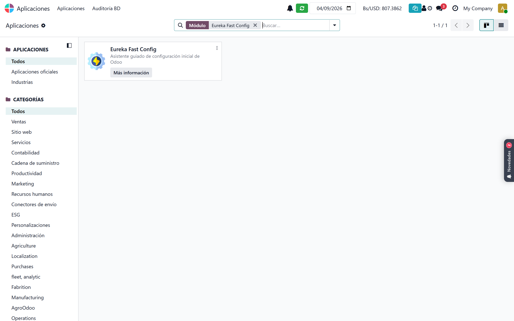

El módulo solo depende de `web` y `account`. **Los módulos que configura no son
dependencias**: se detectan con `ir.module.module` y sus pasos aparecen
únicamente si están instalados.

### Dónde aparece

Una vez instalado, en el lanzador de aplicaciones aparece **Fast Config**:


El menú de la aplicación lleva a tres sitios:

| Menú | Lleva a |
|---|---|
| **Abrir Asistente** | La página del asistente, en `/fast_config` |
| **Auditoría → Progreso de pasos** | Estado guardado de cada paso, por compañía |
| **Auditoría → Bitácora** | Registro de cada guardado, omisión, importación o deshacer |

El asistente es una **página propia**, fuera del webclient de Odoo. Se puede
entrar directamente escribiendo `/fast_config` en la barra de direcciones. Desde
la propia página se vuelve a Odoo con el enlace *Volver a Odoo*, abajo del todo
en la barra lateral.

> La primera vez que se abre, la página tarda unos segundos mientras Odoo compila
> sus estilos y scripts. Una pantalla en blanco al principio no es un error.

---

## 3. Permisos: quién puede ver y quién puede escribir

| Grupo | Puede |
|---|---|
| **Configuración Rápida → Consultor (solo lectura)** | Abrir el asistente y revisar pasos, diagnóstico, avance y bitácora. |
| **Administración del sistema** | Todo lo anterior, más guardar, omitir, cambiar el alcance, instalar módulos e importar plantillas. Implica el grupo de consultor. |

El objetivo del grupo de consultor es no tener que repartir permisos de
administrador solo para que alguien **mire** qué falta.

En modo consulta el bloqueo es real, no cosmético: las rutas de escritura exigen
administrador, el servidor manda los campos como solo lectura y el contenido del
paso va dentro de un `<fieldset disabled>`. La barra lateral muestra una marca
**Modo consulta** para que quede claro por qué no se puede guardar.

---

## 4. El flujo completo, de un vistazo

Este es el recorrido normal de una puesta en marcha. Cada punto se detalla en su
sección.

1. **Elegir el perfil de la empresa** (§5). Descarta de entrada las etapas que
   esa empresa no usa. Solo ocurre la primera vez.
2. **Mirar el Inicio** (§6). Cuánto falta, qué está roto, por dónde empezar.
3. **Recorrer los pasos** (§7 y §8). Uno a uno, o saltando con el buscador y los
   filtros. Cada paso se guarda por separado.
4. **Resolver el diagnóstico** (§9). El objetivo no es llegar al 100 %, es que no
   queden avisos rojos.
5. **Revisar el Centro de Secuencias** (§14). Los correlativos son lo último que
   se quiere descubrir mal el día de la primera factura.
6. **Cerrar con el Resumen** (§17). Estado final de cada paso y bitácora.
7. **Exportar la plantilla** (§15) si esta configuración va a repetirse en otra
   instancia.

El asistente **no obliga a un orden**. La única dependencia dura es el **Plan de
Cuentas**: hasta que hay un plan cargado, los pasos que necesitan cuentas,
diarios o impuestos aparecen como *Bloqueado*.

---

## 5. Primera ejecución: elegir el perfil de la empresa

La primera vez que se abre el asistente para una compañía, antes de cualquier
otra cosa, pregunta qué tipo de empresa es:

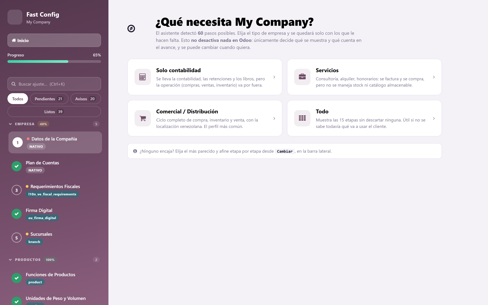

El asistente arma unos **60 pasos** y casi ninguna empresa los necesita todos. El
perfil elige de entrada qué **etapas** aplican:

| Perfil | Para quién | Qué descarta |
|---|---|---|
| **Solo contabilidad** | Se lleva la contabilidad, las retenciones y los libros, pero la operación va por fuera | Productos, Inventario, Compras, Ventas, FDVE |
| **Servicios** | Consultoría, alquiler, honorarios: se factura y se compra, pero no hay stock | Productos, Inventario, FDVE |
| **Comercial / Distribución** | Ciclo completo de compra, inventario y venta. El más común | FDVE |
| **Todo** | No se sabe todavía qué va a usar el cliente | Nada |

Tres cosas importantes:

- **Empresa, Contabilidad y Secuencias no se pueden descartar** en ningún perfil.
  Sin identificación fiscal, plan de cuentas y correlativos no se factura en
  ninguna configuración.
- **Descartar no desactiva nada en Odoo.** Un paso descartado solo sale del
  porcentaje y de los contadores, y deja de gastar consultas de diagnóstico.
  Sigue siendo accesible desde el buscador y desde el filtro *No aplica*, y se
  puede configurar igual.
- **No es una decisión definitiva.** Se afina etapa por etapa cuando se quiera
  (§13).

Si ninguno encaja, elija el más parecido y ajústelo después.

---

## 6. La pantalla de Inicio

Es el tablero del asistente: dónde está la empresa y qué hacer a continuación.

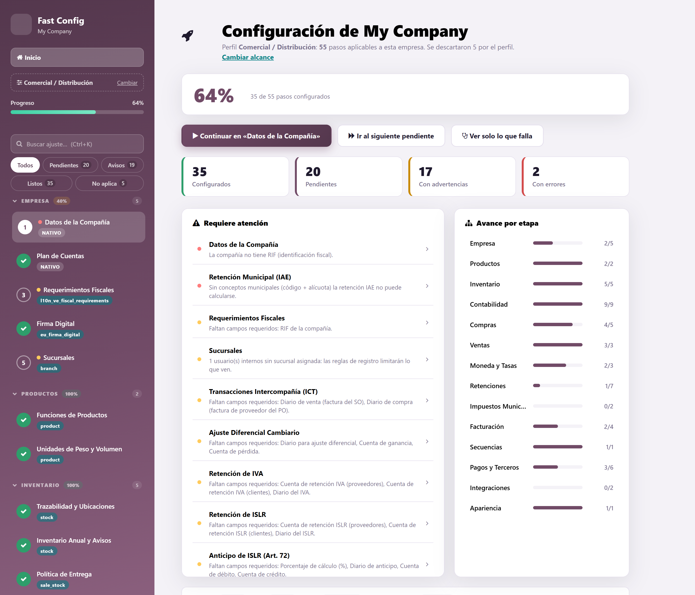

De arriba abajo:

- **Cabecera.** Nombre de la compañía, perfil aplicado, cuántos pasos aplican y
  cuántos se descartaron. El enlace *Cambiar alcance* abre el diálogo de §13.
- **Porcentaje global.** Mide **solo lo que esa empresa necesita**: los pasos
  descartados no cuentan ni a favor ni en contra.
- **Tres accesos directos:**
  - *Continuar en «…»* vuelve al paso donde se quedó la última vez.
  - *Ir al siguiente pendiente* salta al primer paso sin tocar.
  - *Ver solo lo que falla* aplica el filtro de avisos en la barra lateral.
- **Cuatro contadores:** Configurados, Pendientes, Con advertencias, Con errores.
- **Requiere atención.** La lista de lo que está mal, **ordenada por gravedad**:
  primero los errores (punto rojo), después los avisos (punto ámbar). Cada línea
  dice qué falta y lleva al paso con un clic. Esta lista es el mejor sitio para
  empezar el trabajo del día.
- **Avance por etapa.** Cuántos pasos completos hay en cada una de las 15 etapas.

> **Progreso y diagnóstico son dos ejes distintos.** Un paso puede estar *Listo*
> (alguien lo completó) y aun así tener avisos (el diagnóstico encontró algo).
> Por eso hay un porcentaje **y** unos contadores de advertencias.

---

## 7. La barra lateral: filtros y buscador

La barra lateral es la navegación permanente: está en todas las pantallas.

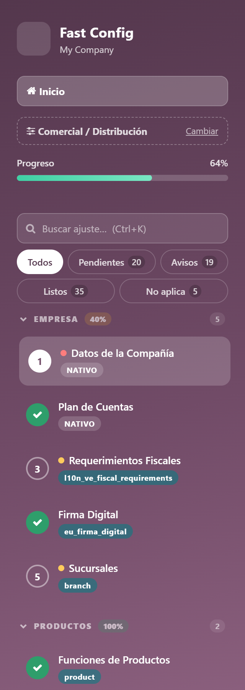

Contiene, de arriba abajo: el botón **Inicio**, el chip del **perfil** con su
enlace *Cambiar*, la barra de **progreso**, el **buscador**, los **filtros** y la
lista de pasos agrupada por etapa.

### Filtros

| Filtro | Muestra |
|---|---|
| **Todos** | Todos los pasos aplicables |
| **Pendientes** | Los que nadie ha tocado todavía |
| **Avisos** | Los que el diagnóstico marcó en ámbar o rojo |
| **Listos** | Los completados |
| **No aplica** | Los descartados por el perfil o marcados a mano |

Hay además una opción para **ocultar los pasos cuyo módulo no está instalado**,
**activa por defecto**: en una base típica eran unos 20 de los 60 y solo
estorbaban.

Los botones *Anterior* y *Siguiente* del pie de cada paso se mueven **solo por lo
que está visible** con el filtro actual. El paso en el que usted está nunca se
oculta, aunque deje de cumplir el filtro.

### Buscador

Con ~60 pasos, buscar es más rápido que recorrer. Se abre con `Ctrl+K` o
haciendo clic en la caja:

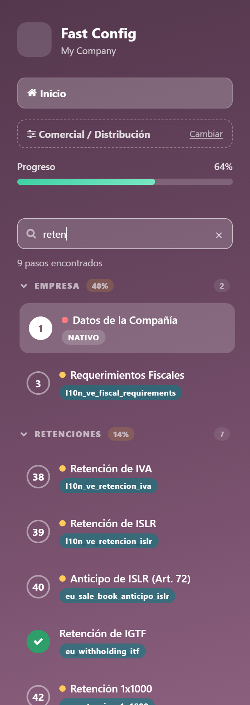

Busca en el título, el subtítulo, la etapa, el nombre del módulo y **las
etiquetas de los campos** — así que se puede buscar por el nombre del ajuste, no
solo por el del paso. Ignora tildes y mayúsculas. `Esc` limpia la búsqueda.

### El asistente recuerda dónde quedó

El paso en el que estaba, los filtros y qué secciones tenía plegadas se guardan
en el navegador, **por compañía**. Al volver, el asistente reabre donde lo dejó.

---

## 8. Anatomía de un paso

Todos los pasos tienen la misma estructura, sea cual sea el módulo que
configuran.

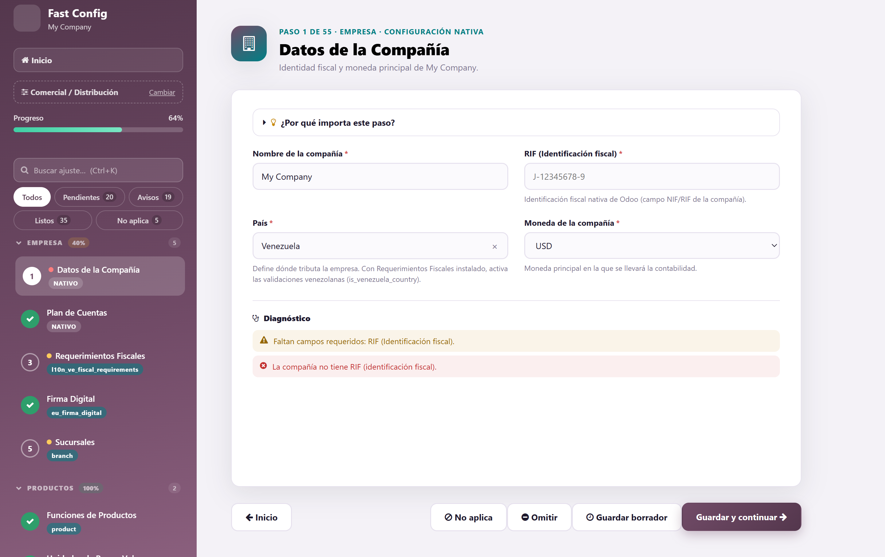

1. **Cabecera.** «PASO 1 DE 55 · EMPRESA · CONFIGURACIÓN NATIVA»: posición,
   etapa y origen del paso. Debajo, el título y una frase que explica qué se
   configura ahí.
2. **Marcas de estado.** Cuando aplica, aparecen junto al subtítulo: *Configurado
   por … · fecha*, *Tiene cambios sin guardar en este paso*, *Modo consulta*,
   *No aplica*.
3. **Bloque de ayuda** *¿Por qué importa este paso?* (§ siguiente).
4. **Campos.** Con su etiqueta, su asterisco si son obligatorios y, debajo, una
   línea de ayuda que explica qué depende de ese dato. Los campos que apuntan a
   otro registro (cuentas, diarios, impuestos) traen autocompletado: se escribe y
   se elige con `↑` `↓` y `Enter`.
5. **Diagnóstico.** El semáforo del paso (§9).
6. **Pie.** La barra de acciones (§10).

### El bloque «¿Por qué importa este paso?»

Los pasos donde equivocarse cuesta caro llevan un bloque plegable con dos cosas:
qué depende de ese dato, y qué se rompe si queda mal.

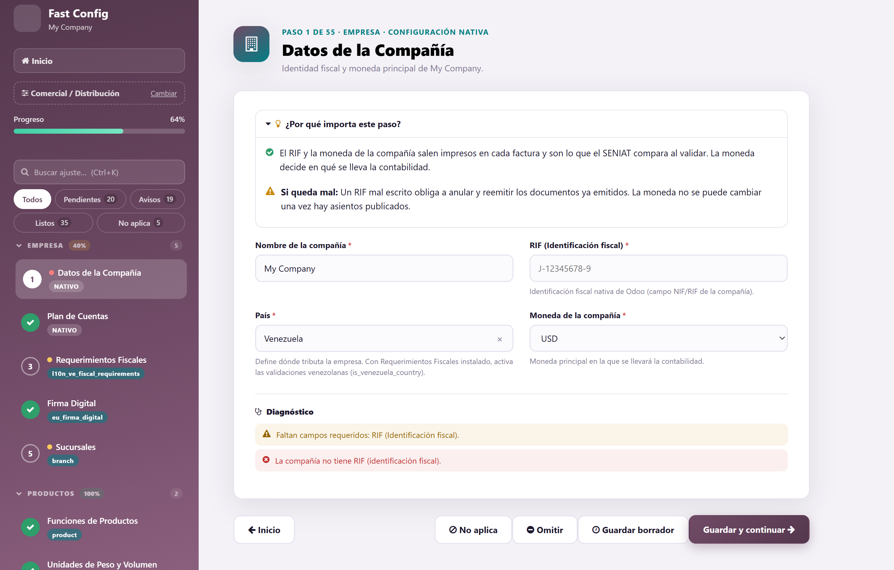

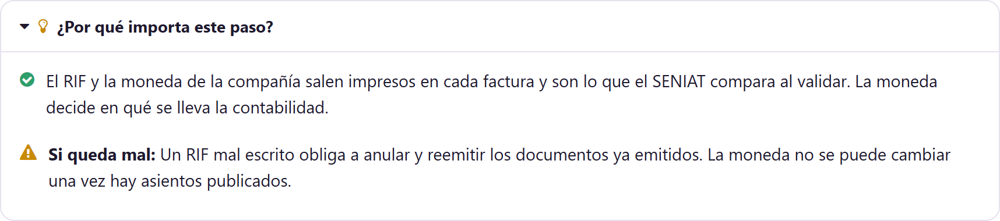

No es documentación genérica: cada texto está escrito para ese paso concreto y
para lo que pasa en Venezuela cuando se equivoca. Lo tienen los pasos de datos de
la compañía, plan de cuentas, requerimientos fiscales, sucursales, alícuotas,
posiciones fiscales, categorías de producto, precisión decimal, moneda de
referencia, tasas BCV, retención municipal, series y Centro de Secuencias.

---

## 9. Estados de un paso y diagnóstico

### Estados

| Estado | Significa |
|---|---|
| **Pendiente** | Nadie lo ha tocado |
| **Borrador** | Guardado a medias: faltan datos obligatorios |
| **Listo** | Completado desde el asistente |
| **Ya configurado** | Los datos están en la base, pero no se revisaron aquí |
| **Omitido** | Se revisó y se decidió no configurarlo, con motivo |
| **Bloqueado** | Espera al Plan de Cuentas |
| **No aplica / No instalado** | Fuera del alcance de esta empresa |

*Ya configurado* es el estado que más confunde al principio: quiere decir que el
asistente encontró los datos puestos (de una instalación previa, de una
plantilla, o porque alguien los configuró por los menús de Odoo), pero **nadie ha
confirmado desde aquí que estén bien**. Merece una revisión.

### Diagnóstico

Cada paso corre su propio diagnóstico contra la base y devuelve una lista de
observaciones con tres niveles:

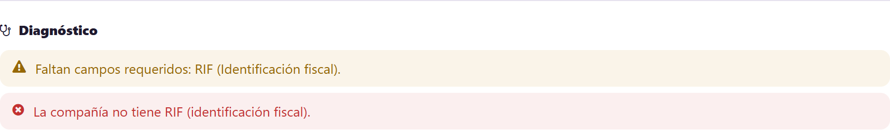

| Nivel | Qué es | Qué hacer |
|---|---|---|
| 🟢 Verde | Sin observaciones | Nada |
| 🟠 Ámbar | Aviso: funciona, pero algo quedará limitado | Revisar antes de salir a producción |
| 🔴 Rojo | Error: algo no va a funcionar | Resolver antes de facturar |

Los mismos avisos alimentan la lista *Requiere atención* del Inicio y los
contadores. **El objetivo de una puesta en marcha no es llegar al 100 % de
progreso; es quedarse sin rojos.**

---

## 10. Guardar, borrador, omitir, no aplica y deshacer

El pie de cada paso concentra todas las acciones:

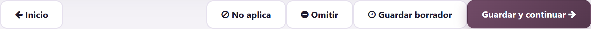

| Botón | Qué hace |
|---|---|
| **Guardar y continuar** | Escribe el paso, registra quién lo hizo, corre el diagnóstico y pasa al siguiente visible. En el último paso se llama *Guardar y finalizar* y lleva al Resumen |
| **Guardar borrador** | Guarda lo que hay **sin exigir los campos obligatorios**. El paso queda como pendiente |
| **Omitir** | Registra que el paso se revisó y se decidió no configurarlo. **Exige un motivo** |
| **No aplica** | Saca el paso del avance de esta empresa. Se revierte con *Sí aplica* |
| **Descartar cambios** | Devuelve el paso a los valores guardados en la base |
| **Deshacer** | Repone los valores anteriores al último guardado |
| **Anterior / Inicio** | Navegación hacia atrás |

**Cada paso se guarda por separado.** No hay un «guardar todo» al final: lo que
se guarda queda guardado, y si se cierra el navegador no se pierde lo confirmado.

### Guardar borrador

Es la respuesta a la situación más común de una implementación: *falta un dato
del cliente*. En vez de dejar el paso vacío o inventar un valor, se guarda lo que
hay y el paso **sigue contando como pendiente**, así que no se olvida.

### Omitir

Omitir no es lo mismo que dejar pendiente. Omitir significa «esto se miró y se
decidió que no». Por eso pide un motivo, que queda en la bitácora:

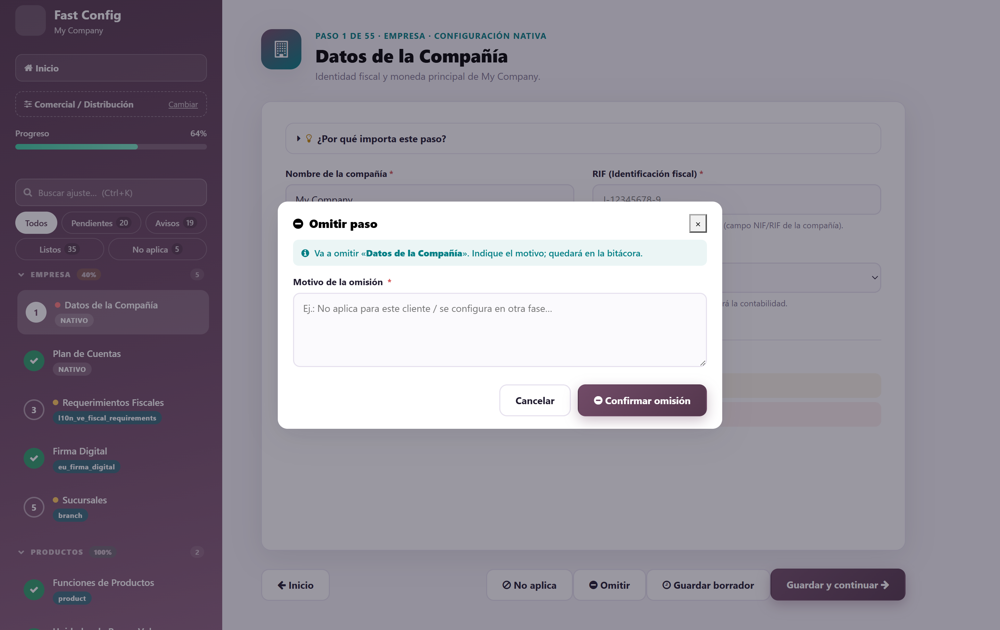

Seis meses después, cuando alguien pregunte por qué esa empresa no tiene
configurada la retención municipal, la respuesta está escrita.

### No aplica

*Omitir* es una decisión sobre un paso; *No aplica* es una decisión sobre el
**alcance**. Un paso marcado *No aplica* sale del porcentaje y de los
contadores, igual que si lo hubiera descartado el perfil, pero se puede seguir
abriendo y configurando.

### Deshacer

Cada guardado toma una foto del paso **antes** de escribir. Mientras esa foto
exista, el paso ofrece **Deshacer**, que repone los valores anteriores y queda
registrado en la bitácora. Se consume al usarla: **un cambio se deshace una vez**.

Sus límites, que conviene conocer antes de confiarse:

- Repone **valores**, nada más. No elimina los registros creados desde el paso ni
  mueve correlativos hacia atrás.
- **El Plan de Cuentas y el Centro de Secuencias no se pueden deshacer.** Cargar
  un plan crea cientos de registros: volver atrás no sería reponer un valor,
  sería borrar contabilidad. Y bajar un correlativo puede repetir números de
  comprobante ya emitidos; eso se corrige a mano, mirando lo que hay emitido.

---

## 11. Cambios sin guardar

Lo que se teclea y no se guarda **no se pierde al moverse entre pasos**: queda en
memoria hasta que se guarde o se descarte.

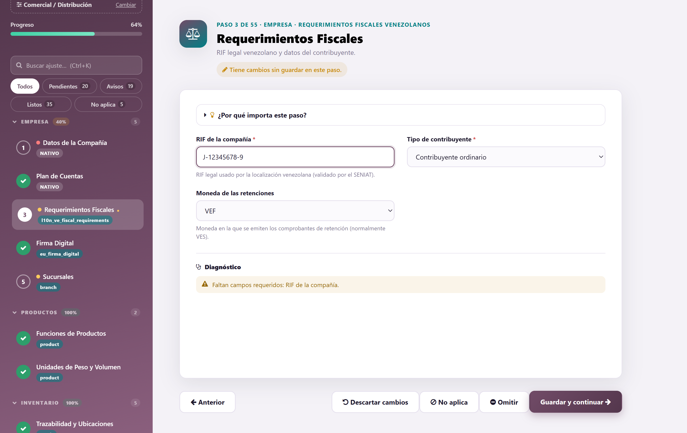

El asistente lo señala en tres sitios:

- Junto al subtítulo del paso: *Tiene cambios sin guardar en este paso*.
- En la barra lateral, con un **punto ámbar** al lado del paso afectado:

  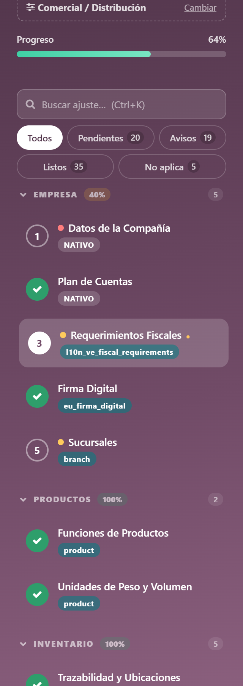

- En el pie de la barra lateral, con un contador desplegable de cuántos pasos
  están a medias, que lleva a cada uno.

Al recargar o salir de la página, el navegador avisa.

**Dos operaciones exigen no tener nada pendiente**: cambiar de compañía e
importar una plantilla. Ambas reemplazan el estado completo del asistente, así
que lo no guardado se perdería sin remedio.

---

## 12. Vista previa antes de escribir, y tablas largas

### Vista previa

Los pasos que tocan **datos vivos** de forma difícil o imposible de revertir no
escriben de golpe: primero enseñan qué va a cambiar, con el valor anterior
tachado y el nuevo al lado.

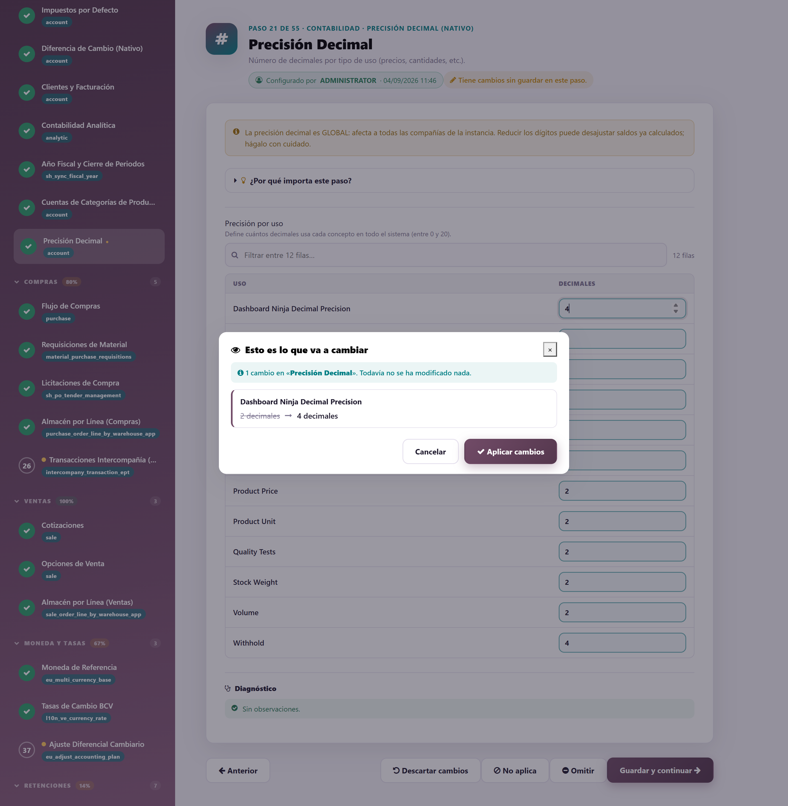

Los cambios peligrosos van marcados en rojo, con su motivo. Hasta pulsar
*Aplicar cambios* **no se ha modificado nada**.

Lo hacen: Plan de Cuentas, Alícuotas de Impuestos, Posiciones Fiscales, Cuentas
de Categorías de Producto, Precisión Decimal, Moneda de Referencia y Centro de
Secuencias. Si no cambió nada respecto a lo que hay en la base, el diálogo no
aparece: pedir confirmación de nada sería ruido.

### Tablas largas

Los pasos que presentan una tabla o una matriz con más de 8 filas traen buscador
propio, filtro de filas incompletas y paginación de 25 en 25:

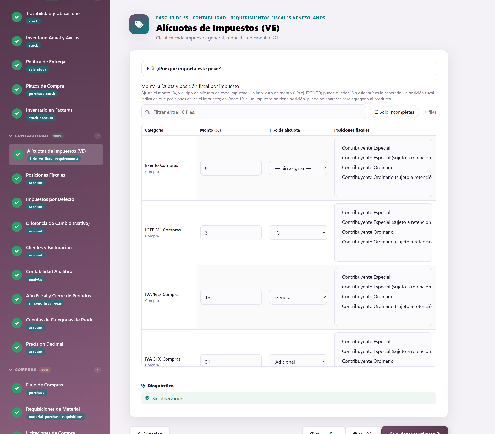

El filtro es **solo de pantalla**: al guardar se envía la tabla entera, no solo
lo que se ve.

---

## 13. Cambiar el alcance más tarde

El perfil elegido al principio se puede afinar en cualquier momento, desde
*Cambiar* en la barra lateral o *Cambiar alcance* en el Inicio:

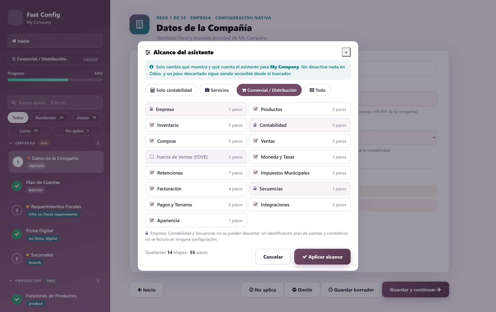

Arriba, los cuatro perfiles como atajo. Debajo, **las 15 etapas una por una**,
con cuántos pasos aporta cada una; se marcan y desmarcan a mano. En cuanto se
toca una etapa suelta, el perfil pasa a llamarse **Personalizado**.

Las tres etapas con candado —Empresa, Contabilidad y Secuencias— no se pueden
desmarcar.

Abajo a la izquierda, el resumen de lo que quedaría: *Quedarían 14 etapas · 55
pasos*. Nada se aplica hasta pulsar **Aplicar alcance**.

El alcance vive en la compañía, es distinto para cada empresa del grupo, viaja en
las plantillas y queda registrado en la bitácora.

---

## 14. Centro de Secuencias

Los correlativos son lo que nadie mira hasta que falla la primera factura. El
Centro de Secuencias pone **todas** las secuencias de la base en una pantalla:

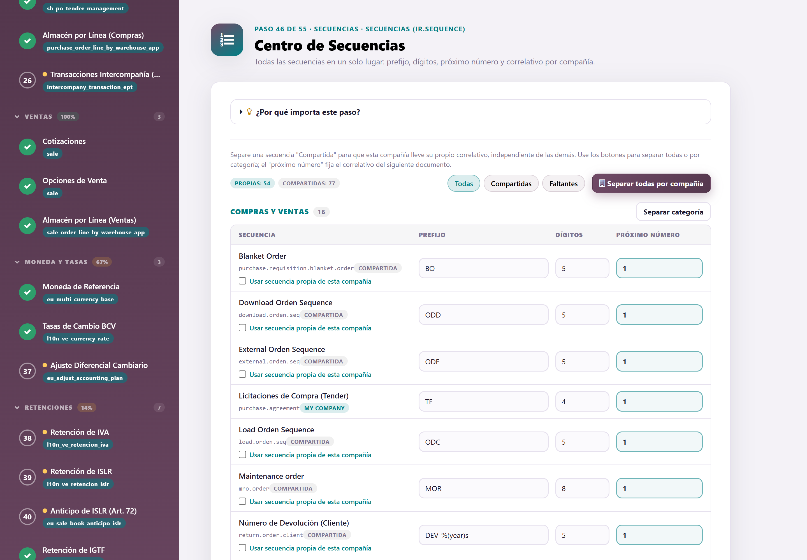

Cada fila muestra el **prefijo**, los **dígitos**, el **próximo número** y, si la
secuencia es compartida, la casilla *Usar secuencia propia de esta compañía*.

Están agrupadas por categoría: Compras y Ventas, Pagos, Retención IVA, Retención
ISLR, Retención IGTF, Otras Retenciones, Impuesto Municipal (IAE), Nómina y Otras
Secuencias.

Arriba hay tres filtros —**Todas**, **Compartidas**, **Faltantes**— y dos
contadores: cuántas secuencias son propias de esta compañía y cuántas compartidas
con el resto de la instancia. El botón **Separar todas por compañía** (y el
*Separar categoría* de cada grupo) crea de una vez el correlativo propio, que es
lo normal cuando cada empresa del grupo emite sus propios documentos.

> Este paso **no se puede deshacer**. Bajar un correlativo por debajo de lo ya
> emitido repite números de comprobante. Antes de tocar el *próximo número*,
> mire qué hay emitido.

---

## 15. Plantillas: llevar una configuración a otra instancia

**Exportar plantilla** descarga un JSON con toda la configuración del asistente.
**Importar plantilla** la aplica en otra base.


Las referencias viajan **por código o por nombre, nunca por id**, para que una
cuenta o un diario se resuelvan correctamente en la base destino aunque allí
tengan otro número interno.

**Nunca viajan en la plantilla:** credenciales, datos de identidad (RIF, nombre
legal), el próximo número de las secuencias ni su separación por compañía. Una
plantilla se puede pasar entre clientes sin filtrar nada de nadie.

Al importar, lo primero es una **vista previa** (una simulación, sin escribir
nada):

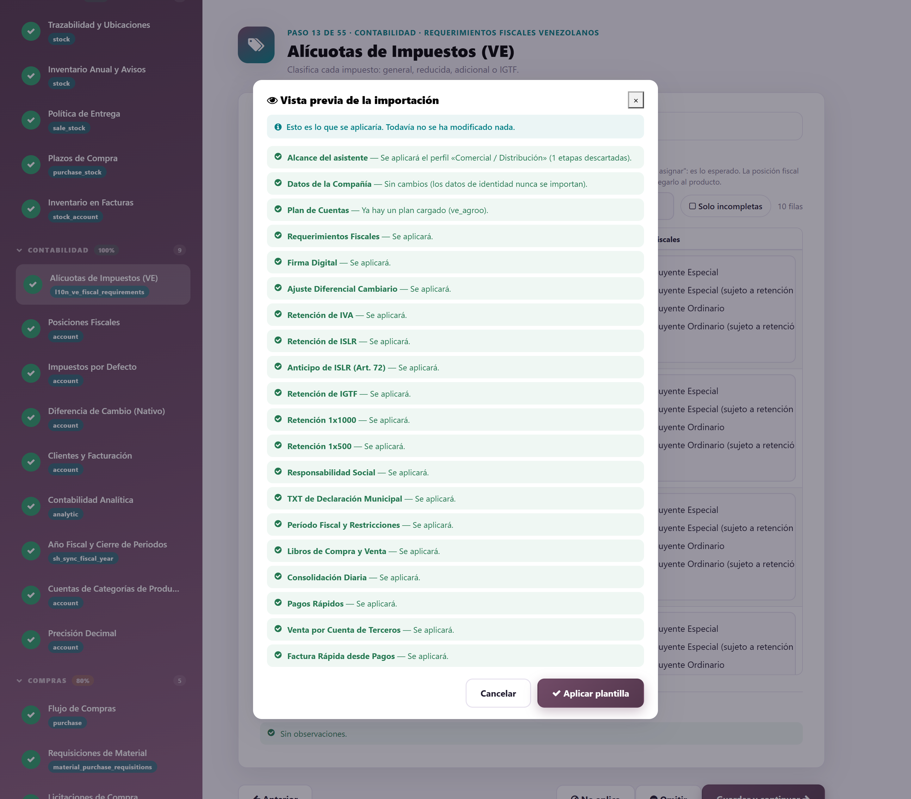

La vista previa dice, paso por paso, qué se aplicaría, qué se omitiría y por qué,
y qué referencias del JSON no existen en la base destino. Solo al pulsar
**Aplicar plantilla** se escribe.

La plantilla lleva también el **alcance** (perfil y etapas descartadas), que se
aplica antes que ningún paso.

---

## 16. Multiempresa

El selector de la barra lateral decide **qué compañía se está configurando**.
Todo lo que depende de compañía —campos de la compañía, ajustes nativos, cuentas,
diarios, impuestos, secuencias, sucursales, el progreso y la bitácora— se lee y
se escribe sobre ella.

Cada empresa del grupo tiene su propio perfil, su propio porcentaje y su propia
bitácora.

Dos advertencias:

- Los **parámetros de sistema** (`ir.config_parameter`) son globales a la
  instancia: no dependen de la compañía elegida. Los pasos que los tocan lo dicen
  en su texto de ayuda.
- **Cambiar de compañía exige no tener cambios sin guardar** (§11).

---

## 17. Auditoría: quién configuró qué

### Dentro del asistente

Al pasar del último paso se llega al **Resumen de la configuración**:

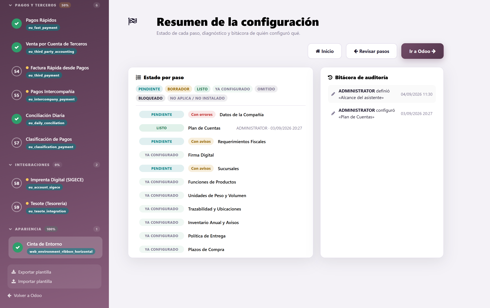

A la izquierda, el estado de cada paso con la leyenda de los siete estados
arriba, y quién lo configuró y cuándo. A la derecha, la **bitácora**: cada
guardado, omisión, cambio de alcance, importación o deshacer, con su autor y su
fecha.

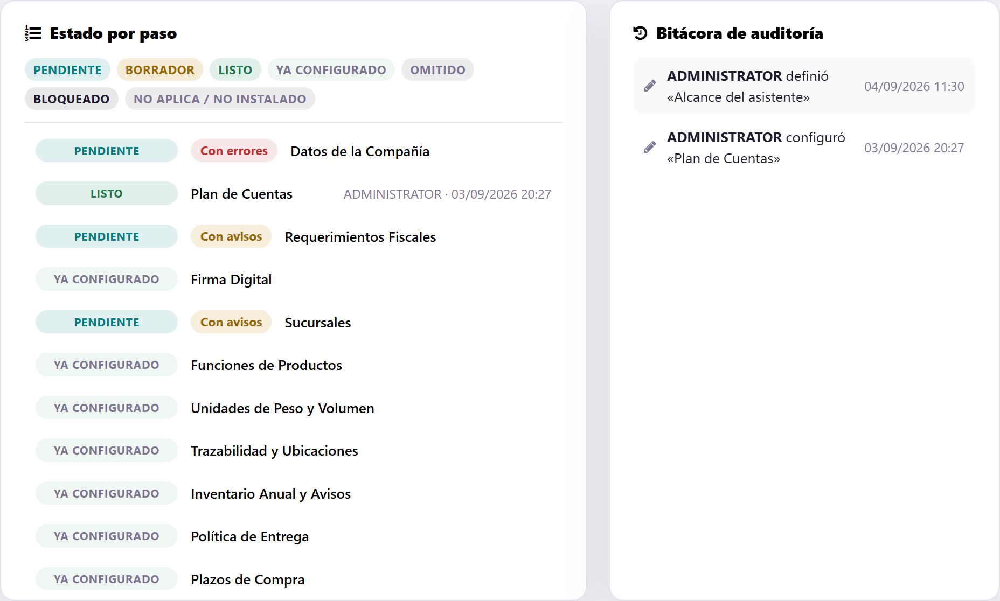

Desde aquí se vuelve al Inicio, se revisan los pasos o se sale a Odoo.

### Desde el backend

Las mismas dos cosas, como listas de Odoo, filtrables y exportables, en **Fast
Config → Auditoría**:

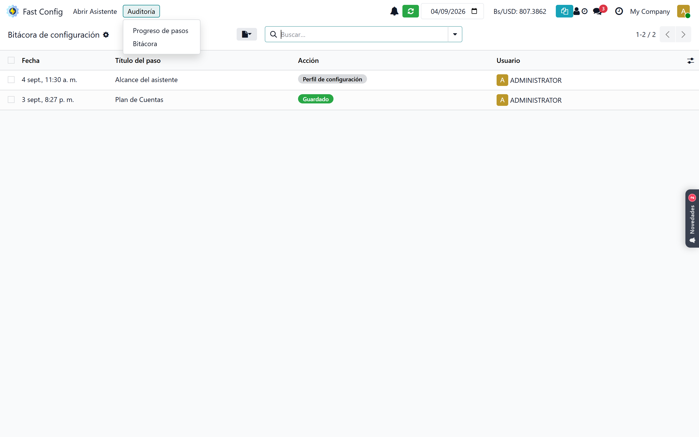

**Progreso de pasos** — el estado guardado de cada paso, con su motivo de omisión
si lo tiene, quién y cuándo. Trae filtros por Completados, Borradores y Omitidos,
y agrupación por usuario, estado y compañía:

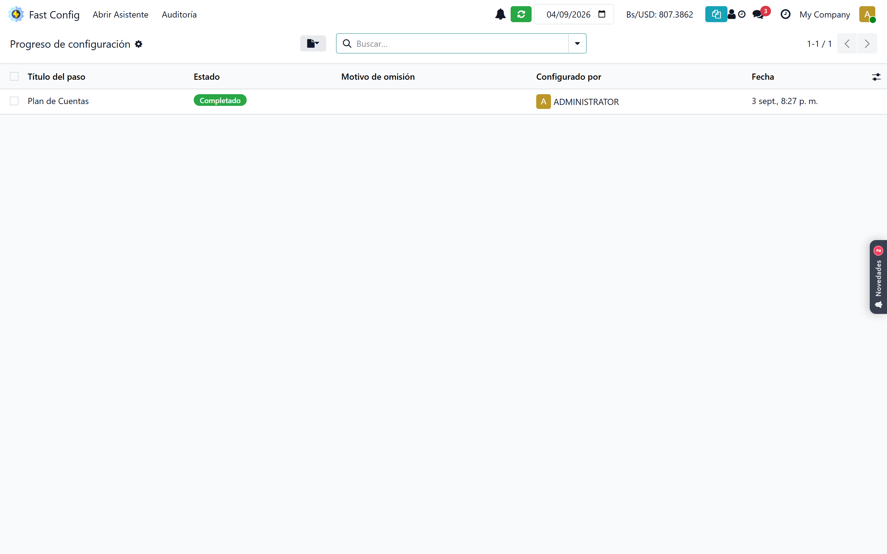

**Bitácora** — el histórico de acciones. Es la lista que responde a «¿quién tocó
esto y cuándo?»:

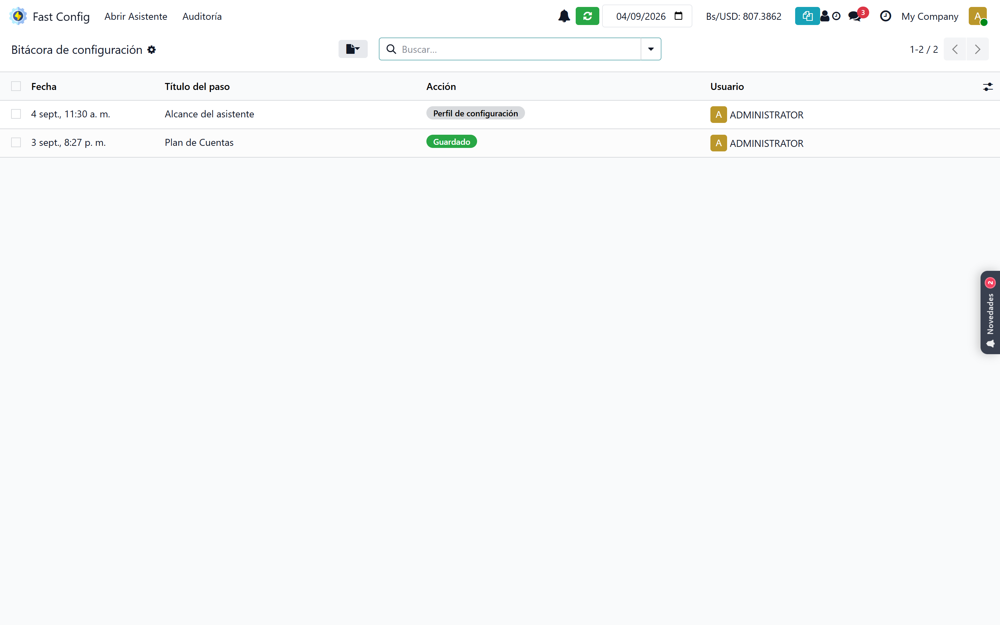

Ambas listas son de solo lectura: no se crean ni se editan a mano.

---

## 18. Guía del implementador

### 18.1 Orden de trabajo recomendado

1. **Instale primero todos los módulos** que va a llevar el cliente. El asistente
   arma la lista de pasos al abrirse; los módulos que instale después aparecerán,
   pero es más cómodo verlos todos desde el principio.
2. **Elija el perfil** con el cliente delante. Es la conversación de «¿usted
   maneja inventario?» y dura dos minutos.
3. **Cargue el Plan de Cuentas antes que nada.** Es la única dependencia dura:
   hasta que haya plan, unos veinte pasos están *Bloqueado*. Al guardarlo se
   desbloquean todos de golpe.
4. **Complete la etapa Empresa.** El RIF y la moneda condicionan validaciones y
   documentos en toda la instancia.
5. **Trabaje desde *Requiere atención***, no de arriba abajo. La lista del Inicio
   está ordenada por gravedad.
6. **Deje el Centro de Secuencias para el final**, cuando ya existan los diarios
   y las series.
7. **Cierre con el Resumen** y, si esta configuración se va a repetir, **exporte
   la plantilla**.

### 18.2 Cuando un módulo no está instalado

Un paso cuyo módulo falta aparece como **No instalado** y ofrece **instalarlo
desde el propio asistente**, sin salir a Aplicaciones. Por defecto estos pasos
están ocultos (§7); para verlos, desactive la opción de ocultarlos en la barra
lateral.

### 18.3 Qué no hace el asistente

Conviene tenerlo claro antes de prometerlo:

- **No sustituye a los Ajustes de Odoo.** Aplica la configuración nativa igual
  que ellos (`res.config.settings`), pero solo los ajustes que ha modelado.
- **Descartar un paso no desactiva nada.** Solo cambia qué se muestra y qué
  cuenta.
- **Deshacer tiene límites** (§10): repone valores, no borra registros ni mueve
  correlativos hacia atrás.
- **Los parámetros de sistema son globales**, no por compañía (§16).
- Un paso cuyo módulo figura como instalado pero cuyo código no carga se degrada
  a *No disponible* y **el resto del asistente sigue funcionando**. Cada paso se
  construye aislado precisamente para eso.

### 18.4 Añadir pasos desde otro addon

Sin tocar este módulo ni declarar dependencia dura, desde el `__init__.py` del
addon:

```python
try:
    from odoo.addons.eu_fast_config.definitions import F, register_declarative_step
except ImportError:
    register_declarative_step = None      # eu_fast_config no está instalado

if register_declarative_step:
    register_declarative_step({
        'key': 'mi_paso', 'stage': 'ventas', 'module': 'mi_addon',
        'title': 'Mi ajuste', 'icon': 'fa-cog',
        'module_label': 'Mi Addon', 'subtitle': 'Qué hace.',
        'fields': [F('mi_campo', 'boolean', 'Activar algo')],
    })
```

Valida la etapa y las claves obligatorias, es idempotente y recalcula solo los
módulos vigilados y el bloqueo por plan de cuentas. Existen también
`register_native_step()` y `register_step_guide(step_key, why, risk)` — esta
última añade el bloque *¿Por qué importa este paso?*.

El servidor entrega la definición completa de los pasos en
`/eu_fast_config/state`; el JavaScript es un **renderizador genérico** y no
conoce ningún addon en particular.

### 18.5 Los tres tipos de paso

| Tipo | Dónde vive | Cómo se guarda |
|---|---|---|
| **Declarativo** | `DECLARATIVE_STEPS` en `definitions.py` | Campos de `res.company` o de `ir.config_parameter` (vía `param`) |
| **Ajuste nativo** | `NATIVE_SETTINGS_STEPS` | `res.config.settings.create().execute()`, igual que los Ajustes estándar |
| **Especial** | Builder `_step_<key>` en `controllers/main.py` | Su propio `_save_<key>`, con `_check_<key>` opcional para el diagnóstico |

Para soportar un módulo nuevo, lo normal es añadir una entrada a
`DECLARATIVE_STEPS`. Solo hace falta un builder dedicado si el paso necesita
lógica propia (matrices, tablas, cálculos).

Los tres tipos se ven iguales por pantalla; la cabecera del paso es la que dice
de cuál se trata. Aquí, un ajuste nativo — se aplica exactamente igual que si se
hubiera tocado en los Ajustes de Odoo:

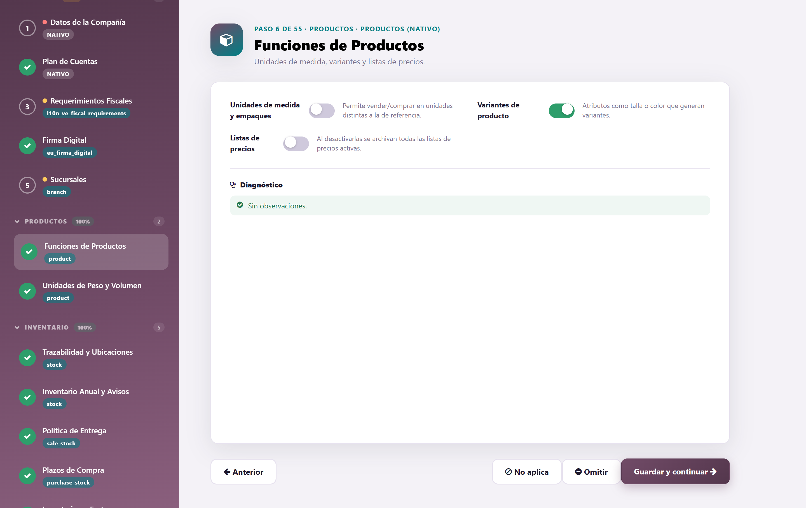

### 18.6 Pruebas

```bash
odoo -d <base> -u eu_fast_config --test-enable --test-tags /eu_fast_config --stop-after-init
```

Cubren la lógica que no necesita una petición HTTP: coherencia del catálogo de
pasos, perfiles, clasificación de secuencias, traducción de errores y los
modelos. Los builders siguen atados a `request` y no están cubiertos.

### 18.7 Si algo va mal

| Síntoma | Causa probable |
|---|---|
| La página tarda o sale en blanco al abrirla la primera vez | Odoo está compilando los estilos y scripts. Espere y recargue |
| Un paso que debería estar no aparece | Su módulo no está instalado, o está oculto por el filtro de módulos no instalados, o su etapa está descartada por el perfil |
| Un paso aparece como *Bloqueado* | Falta cargar el Plan de Cuentas |
| Un paso aparece como *No disponible* | El módulo figura instalado pero su código no carga. Revise el log de Odoo |
| No se puede guardar nada | El usuario está en modo consulta (§3) |
| No deja cambiar de compañía o importar una plantilla | Hay cambios sin guardar (§11) |
| Un error muestra un mensaje poco claro | El mensaje está traducido por caso conocido; el texto técnico está detrás de *Ver detalle*, con botón de copiar |

---

## 19. Anexos

### 19.1 Atajos de teclado

| Atajo | Acción |
|---|---|
| `Ctrl+K` | Buscar un ajuste |
| `Ctrl+S` | Guardar el paso actual |
| `Ctrl+Enter` | Guardar y continuar |
| `Ctrl+←` / `Ctrl+→` | Paso anterior / siguiente |
| `Esc` | Cerrar el diálogo abierto o limpiar la búsqueda |
| `↑` `↓` `Enter` | Recorrer y elegir en los campos con autocompletado |

### 19.2 Catálogo de pasos por etapa

Los pasos marcados con un módulo aparecen **solo si ese módulo está instalado**.

**Empresa** — Datos de la Compañía · Plan de Cuentas · Requerimientos Fiscales
(`l10n_ve_fiscal_requirements`) · Firma Digital (`eu_firma_digital`) · Sucursales
(`branch`)

**Productos** — Funciones de Productos · Unidades de Peso y Volumen (`product`)

**Inventario** — Trazabilidad y Ubicaciones · Inventario Anual y Avisos
(`stock`) · Política de Entrega (`sale_stock`) · Plazos de Compra
(`purchase_stock`) · Inventario en Facturas (`stock_account`)

**Contabilidad** — Alícuotas de Impuestos (VE) · Posiciones Fiscales · Impuestos
por Defecto · Diferencia de Cambio · Clientes y Facturación · Cuentas de
Categorías de Producto · Precisión Decimal (`account`) · Contabilidad Analítica
(`analytic`) · Año Fiscal y Cierre de Periodos (`sh_sync_fiscal_year`)

**Compras** — Flujo de Compras (`purchase`) · Requisiciones de Material
(`material_purchase_requisitions`) · Licitaciones de Compra
(`sh_po_tender_management`) · Almacén por Línea
(`purchase_order_line_by_warehouse_app`) · Transacciones Intercompañía
(`intercompany_transaction_ept`)

**Ventas** — Cotizaciones · Opciones de Venta (`sale`) · Almacén por Línea
(`sale_order_line_by_warehouse_app`)

**Fuerza de Ventas (FDVE)** — App de Fuerza de Ventas (`eu_fdve_user`) · Límite
de Crédito (`eu_credit_limit_approval`) · Órdenes de Devolución
(`eu_return_order`) · Motivos de No Concreción y de Reclamo de Visita
(`eu_visit`)

**Moneda y Tasas** — Moneda de Referencia (`eu_multi_currency_base`) · Tasas de
Cambio BCV (`l10n_ve_currency_rate`) · Ajuste Diferencial Cambiario
(`eu_adjust_accounting_plan`)

**Retenciones** — Retención de IVA (`l10n_ve_retencion_iva`) · Retención de ISLR
(`l10n_ve_retencion_islr`) · Anticipo de ISLR Art. 72
(`eu_sale_book_anticipo_islr`) · Retención de IGTF (`eu_withholding_itf`) ·
Retención 1x1000 (`eu_retencion_1x1000`) · Retención 1x500
(`eu_retencion_1x500`) · Responsabilidad Social (`eu_retencion_res_social`)

**Impuestos Municipales** — Retención Municipal IAE (`municipality_tax`) · TXT de
Declaración Municipal (`eu_municipality_tax_txt`)

**Facturación** — Series de Facturación (`eu_account_series`) · Período Fiscal y
Restricciones (`l10n_ve_restrictions`) · Libros de Compra y Venta
(`l10n_ve_libros_contables`) · Consolidación Diaria
(`account_daily_consolidate`)

**Secuencias** — Centro de Secuencias

**Pagos y Terceros** — Pagos Rápidos (`eu_fast_payment`) · Venta por Cuenta de
Terceros (`eu_third_party_accounting`) · Factura Rápida desde Pagos
(`eu_third_payment`) · Pagos Intercompañía (`eu_intercompany_payment`) ·
Conciliación Diaria (`eu_daily_conciliation`) · Clasificación de Pagos
(`eu_classification_payment`)

**Integraciones** — Imprenta Digital SIGECE (`eu_account_sigece`) · Tesote
(`eu_tesote_integration`)

**Apariencia** — Cinta de Entorno (`web_environment_ribbon_horizontal`)

### 19.3 Documentos relacionados

| Documento | Contiene |
|---|---|
| [`README.md`](../README.md) | Referencia técnica del addon y su estructura |
| [`CHANGELOG.md`](../CHANGELOG.md) | Historial de versiones |
| [`ROADMAP.md`](../ROADMAP.md) | Diagnóstico de usabilidad y hoja de ruta priorizada |

---

CorpoEureka · [corpoeureka.com](https://www.corpoeureka.com) ·
helpdesk@corpoeureka.com
